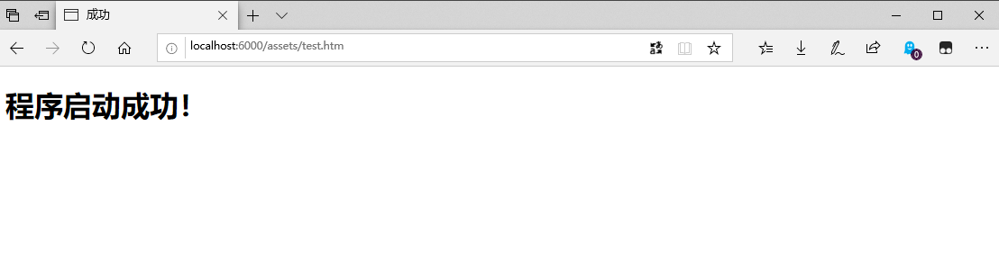
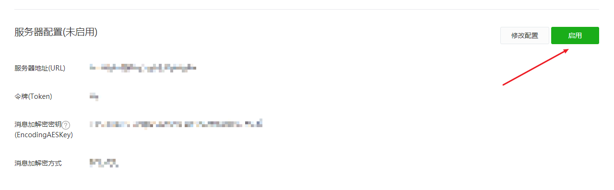

# DotNET Core 实现微信公众号关注推送消息

# 实现思路


# 使用

## 服务器配置
首先你需要在「微信公众平台」中配置你的服务器信息，「开发」-> 「基本配置」->「服务器配置」。`URL` 需要填你的域名但后面需要加上 `WeChat`，例如 `http://wigor.club/WeChat`，Token 你自己随便填，后面程序的 `appsettings.json` 文件中需要填写，`EncodingAESKey` 点击随机生成即可。先不要点击保存，因为你的服务还没起来，点了保存也是报错。

> * 一开始你就需要将你的域名/IP加入到白名单中


## 项目配置
接着将服务跑起来，将项目下载到你本地

> git clone git@github.com:WuMortal/WeChatPushMessage.git

之后进入到 `Wigor.WeChat.PushSubscribeMessage` 项目下

> cd WeChatPushMessage\src\Wigor.WeChat.PushSubscribeMessage

打开文件夹，修改 appsettings.json 中为配置，这里的 Token 就是之前填写的 Token。

Appid 和 Secret 在 微信公众平台中同样可以找到。

在这里说明下，这里提供的功能是发送素材到你的公众号。所以配置了一个 `SendMediaId`，通过 `SendMediaId` 去获取需要发送的图文信息。如果你们想做可以选择素材的效果，可以直接在此项目上修改，这边我提供相关的文档地址：

> 获取素材列表：[https://mp.weixin.qq.com/wiki?t=resource/res_main&id=mp1444738734](https://mp.weixin.qq.com/wiki?t=resource/res_main&id=mp1444738734)

> 获取永久素材（指定 素材ID）：[https://mp.weixin.qq.com/wiki?t=resource/res_main&id=mp1444738730](https://mp.weixin.qq.com/wiki?t=resource/res_main&id=mp1444738730)

素材ID 获取的方式可以直接调用 「获取素材列表」的接口，步骤1.获取 access_token，2.获取素材列表，3.选择自身需要的 素材ID（media_id）。

``` js
appsettings.json

{
  "WeChatSettings": {
    "GrantType": "client_credential", //保持默认
    "Appid": "你的Appid",
    "Secret": "你的Secret",
    "ApiDomain": "https://api.weixin.qq.com",  //保持默认
    "SendMediaId": "需要发送的素材ID",
    "Token": "微信公众号后台 -> 开发 -> 服务器配置中的 token"
  }
}

```

然后打开 cmd 执行如下命令，编译项目，这里我是部署到 IIS ，所以是 win81-x64，根据自身的情况可以调整

> dotnet publish -c release -r win81-x64

打开文件夹 `WeChatPushMessage\src\Wigor.WeChat.PushSubscribeMessage\bin\release\netcoreapp2.2\win81-x64\publish` ，这里面就是部署到 IIS 上的文件。部署完成后再浏览器中输入 [http://localhost:6000/assets/test.htm](http://localhost:6000/assets/test.htm)，出现 “程序启动成功”，代表程序启动已经成功了。



程序启动成功不代表我们就可以点击保存了，你需要将域名指向你的服务器中的程序，如果是测试的话可以使用 花生壳、ngork 之类的内网穿透软件。

之后再「微信公众平台」上点击保存即可，最后点击 `启用`


## 补充
如果想修改程序启动的端口号，直接在 `hostsettings.json` 文件中修改即可。